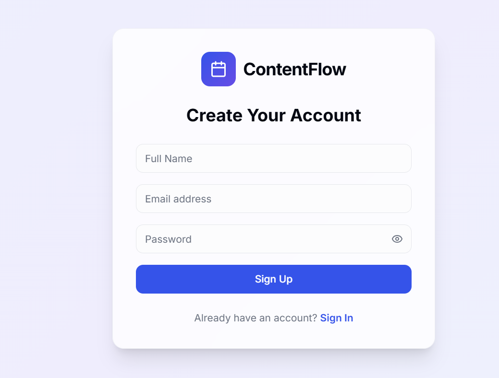

## Project Title: 
ContentFlow-A Social Media Content Scheduler
## Project Description: 
Social Media Content Scheduler is a centralized platform designed to help social media managers efficiently plan, schedule, and track content across multiple platforms. It allows users to automate post publishing, view campaigns through a visual content calendar, monitor engagement with real-time analytics, and collaborate with team members. With features like trending hashtag suggestions  and cross-platform insights, the system ensures consistent posting, improved audience engagement, and significant time savings.
## Features: 
1. Advanced Post Scheduling
Schedule posts in advance across multiple platforms.
Select specific date and time for publishing.
Ensures consistent posting, even during off-hours.
2. Visual Content Calendar
Provides a calendar view of all scheduled posts.
Helps organize campaigns and deadlines.
Supports color-coding and note additions for better planning.
3. Trending Hashtag Suggestions
Suggests relevant and trending hashtags.
Increases post visibility and engagement.
Helps stay updated with social media trends.
4. Detailed Analytics Dashboard
Displays real-time performance metrics.
Tracks likes, comments, shares, reach, CTR, and follower growth.
5. Multi-Platform Integration
Manage multiple accounts from one dashboard.
Customize posts for each platform.
Saves time by avoiding multiple logins.
6. Cross-Platform Insights
Compares performance across platforms.
Identifies which platform gives better results.
Helps optimize content strategy.
7. Content Category Suggestions
Recommends content types (promotional, educational, entertainment).
Ensures a balanced content mix.
Keeps audience engaged with variety.
## Tech Stack Used
 Frontend: React, TypeScript, ShadCN, Tailwind CSS
 Backend: Express.js, Node.js
 Database: Supabase

## Installation Steps
1. Clone the Repository
2. Backend Setup
    Step 1: Navigate to Backend Folder(cd backend)
    Step 2: Install Dependencies(npm install)
    Step 3: Create Environment File
        Create a .env file inside the backend folder and add:
        PORT=8081
        SUPABASE_URL=your_supabase_url
        SUPABASE_SERVICE_ROLE_KEY=your_service_role_key
    Step 4: Start Backend Server(npm run dev)
        Backend will run on: http://localhost:8082
3. Frontend Setup
    Step 1: Navigate to Frontend Folder
        Open a new terminal and run:
        cd frontend
    Step 2: Install Dependencies(npm install)
    Step 3: Configure API URL
        Create a .env file inside the frontend folder and add:
        VITE_API_URL=http://localhost:8081
    Step 4: Start Frontend Server
        npm run dev
        Frontend will run on:
        http://localhost:8081  

## Deployment Link
    https://glistening-syrniki-b8b2a4.netlify.app/signup
## Backend API Link
    http://localhost:8082

## Screenshots
    
## Video Walkthrough Link
